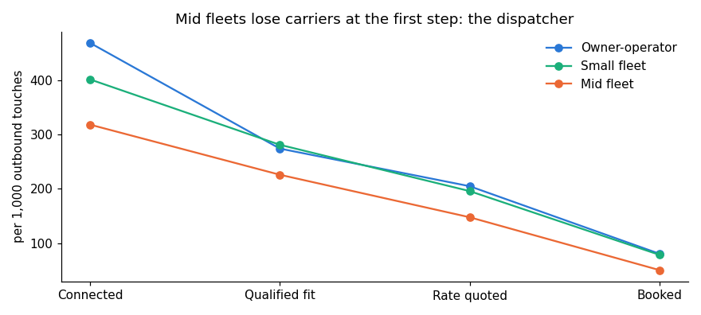

# Metrics pipeline: Python + SQL

Every number on the cockpit, **computed with SQL from event-level data**.

**Start here:** [`report.ipynb`](report.ipynb)

```
pipeline/
├── generate.py     # deterministic synthetic brokerage: 40,000 touches, 2,980 bookings, 2,400 carriers, 250 QA calls
├── data/           # generated CSVs + the dashboard's displayed figures (npm run export:targets)
├── schema.sql      # 5 tables; a CHECK constraint enforces the nested funnel (booked ⇒ quoted ⇒ qualified ⇒ connected)
├── queries/        # one metric-tree question per .sql file
├── metrics.py      # loads CSVs into SQLite, runs queries, returns DataFrames
├── report.ipynb    # the analysis, with charts
└── tests/          # pytest: SQL results must equal what the dashboard shows
```

## How the data is generated

The dashboard's figures are illustrative. `generate.py` builds the raw events a real brokerage would log, calibrated so the aggregates reproduce the dashboard:

- **Exact stage counts:** each funnel stage is an exact, shuffled subset of the one before it.
- **Quantile-exact durations:** time-to-cover is drawn by inverse-CDF sampling of a log-normal, so the median and p90 land on target.
- **Segment mix solved numerically** (40% owner-operator, 41% small fleet, 19% mid fleet), so the blended funnel matches the "all carriers" view.
- **Seeded and deterministic:** CI regenerates the data and fails if one byte changes.

Building this surfaced three places where the original all-carrier tiles weren't consistent with the segment data: median time-to-cover, p90 and rate delta. The dashboard now shows the computed blend.

## Questions and findings

| # | Question | SQL techniques |
|---|---|---|
| 01 | Funnel per 1,000 touches by segment | `UNION ALL` for an "all" rollup, ratio metrics |
| 02 | Where does each segment break first? | unpivot with `UNION ALL`, `RANK()` per segment |
| 03 | Autonomy vs. escalation by week | join of two aggregates at different grains |
| 04 | Segment scorecard tiles | median and nearest-rank p90 with `ROW_NUMBER()`/`COUNT() OVER`, multi-CTE join |
| 05 | D30 repeat rate by cohort | cohort aggregation, conditional averages by segment |
| 06 | Failure taxonomy | share of total with `SUM() OVER ()` |
| 07 | Owner backlog | `GROUP_CONCAT` rollup |

**Scorecard (query 04):**

| segment   |   pct_no_human_w12 |   median_min_to_cover |   p90_min_to_cover |   d30_repeat_pct |   rate_delta_pct |
|:----------|-------------------:|----------------------:|-------------------:|-----------------:|-----------------:|
| all       |                 62 |                    35 |                159 |               34 |              1.5 |
| oo        |                 67 |                    31 |                129 |               41 |              0.9 |
| sf        |                 60 |                    36 |                164 |               33 |              1.6 |
| mf        |                 48 |                    54 |                253 |               22 |              3.1 |

**Worst drop per segment (query 02):**

| segment              | worst_stage   |   drop_pct |
|:---------------------|:--------------|-----------:|
| Mid fleet (31+)      | Connected     |         68 |
| Owner-operator (1-5) | Booked        |         60 |
| Small fleet (6-30)   | Connected     |         60 |



## Tests

```bash
pip install -r pipeline/requirements.txt
python pipeline/generate.py   # optional: regenerates identical data
python pipeline/metrics.py
pytest pipeline -v
```

15 tests check the following:

- **Funnel:** every segment's funnel equals the dashboard exactly.
- **Tiles:** median, p90, repeat rate, rate delta and autonomy match for every segment and the blend.
- **Series:** the weekly autonomy and escalation series and the repeat cohorts match.
- **Integrity:** the schema rejects a non-nested funnel or an orphan booking.
